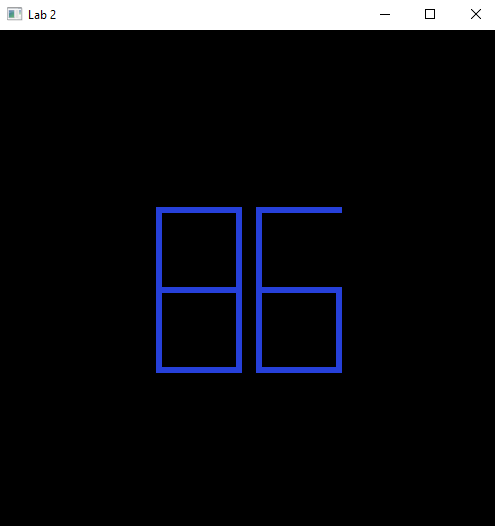
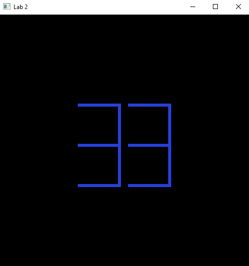

## Task 1 - Draw the last two digits of your ID

- **User can give any ID to get the output**
- **Just put your number, the code will extract the last two digits and draw them**
- **Works for all digits, two samples are given below**

